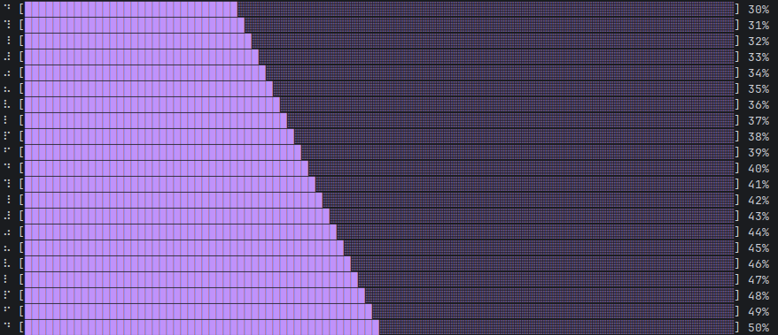
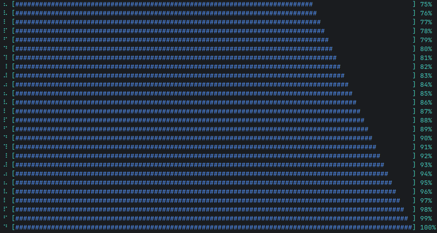
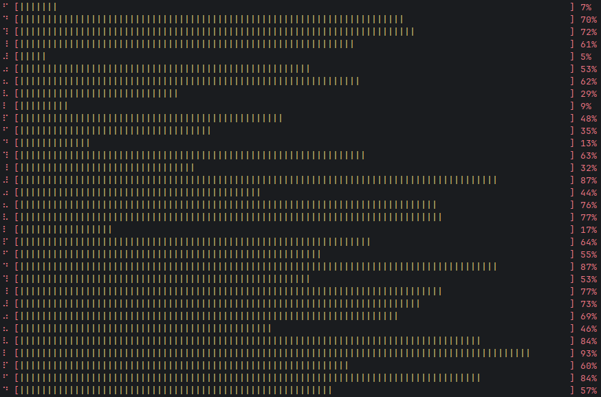
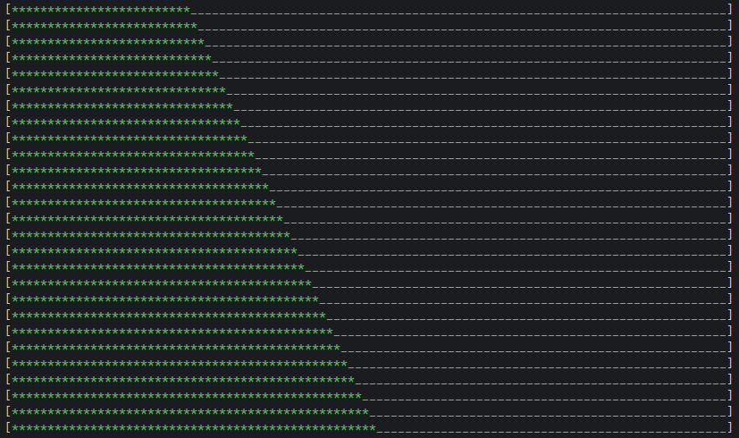

# goProgressBar

Very simple and easy to use progress bar for console

## Examples

```
go get github.com/MothScientist/goProgressBar@latest
```

```go
package main

import (
	"fmt"
	"time"

	progressbar "github.com/MothScientist/goProgressBar"
)

func main() {
	bar := progressbar.GetNewProgressBar()
	bar.SetColors([2]string{progressbar.ColorWhite, progressbar.ColorPurple})
	bar.SetBarLen(100)
	for i := uint8(30); i <= 100; i++ {
		progressBar := bar.Update(i)
		fmt.Println(progressBar)
		time.Sleep(300 * time.Millisecond)
	}
}
```




