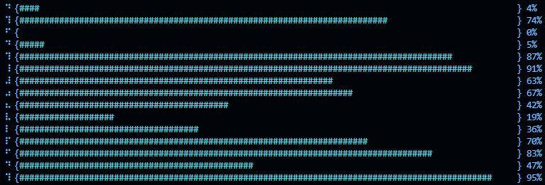
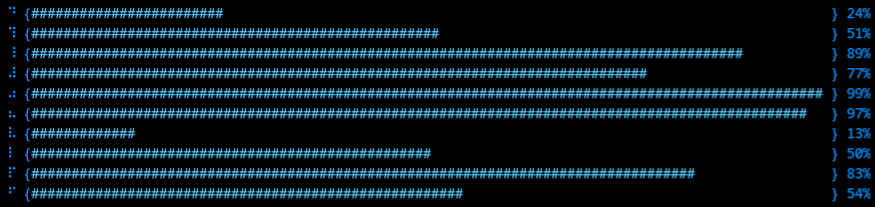
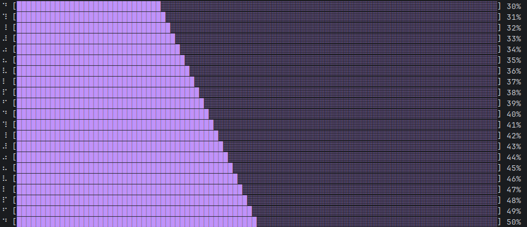
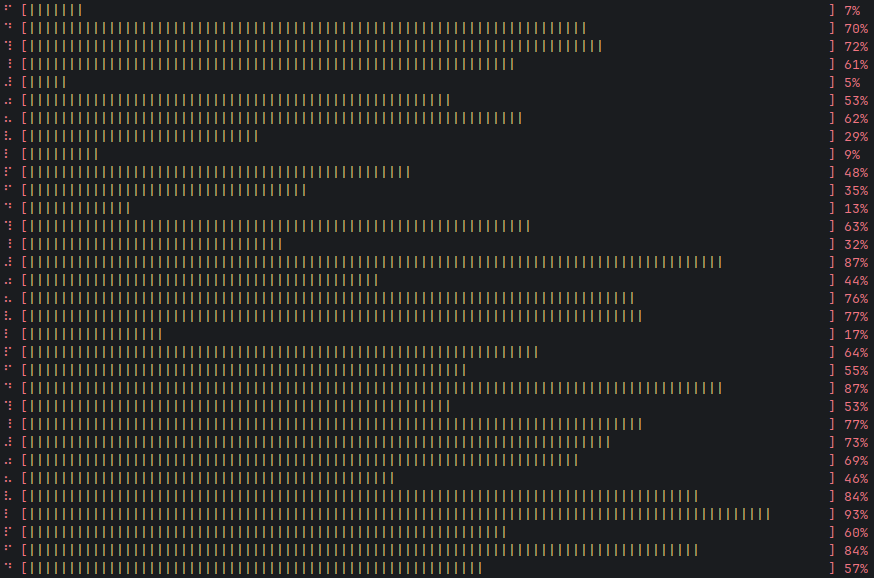
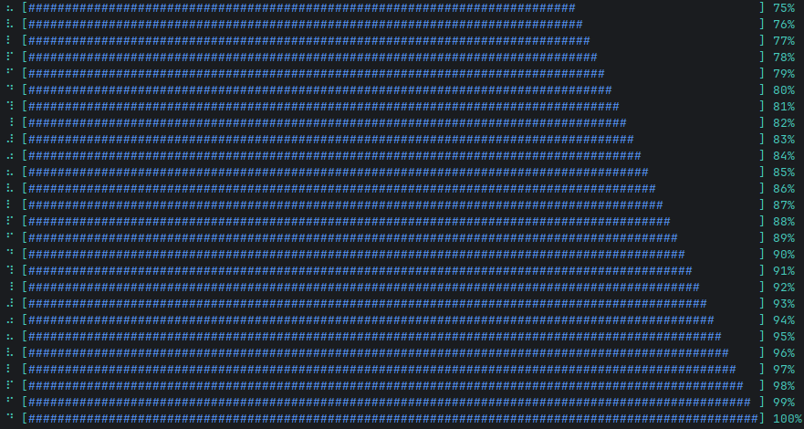

# goProgressBar

- __Easy to use__
- __Large selection of built-in options__
- __Optimized__
- __No external dependencies__

## Installation

```sh
go get github.com/MothScientist/goProgressBar@latest
```

## Launch

```go
package main

import (
	"fmt"
	"time"

	progressbar "github.com/MothScientist/goProgressBar"
)

func main() {
	bar := progressbar.GetNewProgressBar()

	bar.SetSpinner(progressbar.Spinners[1])
	// There is no point in setting the color white in the console,
	// you can save bytes by setting an empty string instead
	bar.SetColors([2]string{"", progressbar.ColorMagenta})
	bar.SetBarLen(100)

	for i := 30; i <= 100; i++ {
		pg, _ := bar.Update(i)
		fmt.Println(pg)
		time.Sleep(300 * time.Millisecond)
	}
}
```

## Examples






